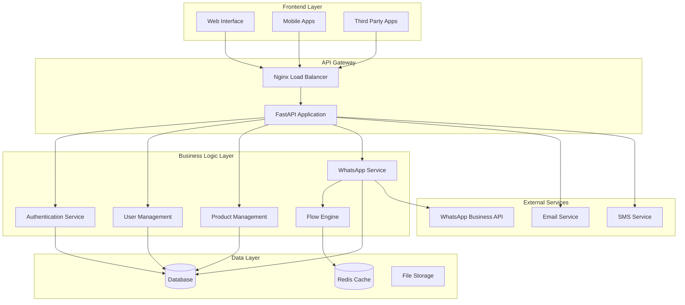
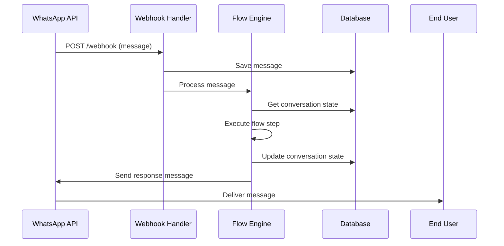
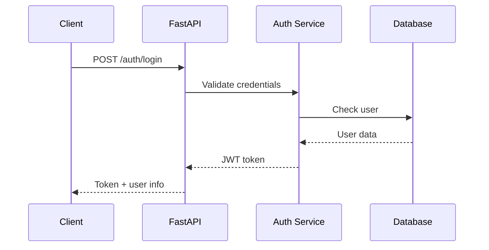

# 🏗️ Arquitectura del Sistema

## 📋 Tabla de Contenidos

1. [Visión General](#visión-general)
2. [Arquitectura de Alto Nivel](#arquitectura-de-alto-nivel)
3. [Estructura del Proyecto](#estructura-del-proyecto)
4. [Patrones de Diseño](#patrones-de-diseño)
5. [Flujo de Datos](#flujo-de-datos)
6. [Componentes Principales](#componentes-principales)
7. [Base de Datos](#base-de-datos)
8. [APIs y Servicios](#apis-y-servicios)
9. [Seguridad](#seguridad)
10. [Escalabilidad](#escalabilidad)

## 🎯 Visión General

Business API Template es una aplicación profesional construida con **FastAPI** que proporciona:

- **API RESTful** para gestión de productos/servicios y usuarios
- **Sistema de WhatsApp Business** con webhook y máquina de estados inteligente
- **Base de datos multi-soporte** (SQLite, PostgreSQL, MySQL)
- **Sistema de logs profesional** con formato JSON y debugging avanzado
- **Autenticación JWT** completa
- **Arquitectura modular** y escalable

## 🏛️ Arquitectura de Alto Nivel



## 📁 Estructura del Proyecto

```
business-api-template/
├── app/                          # Aplicación principal
│   ├── api/                      # Capa de API
│   │   └── v1/                   # Versión 1 de la API
│   │       ├── endpoints/         # Endpoints específicos
│   │       └── api.py            # Router principal
│   ├── core/                     # Configuración central
│   │   ├── config.py             # Configuración de la app
│   │   ├── security.py           # Seguridad y JWT
│   │   ├── logging_config.py     # Configuración de logs
│   │   └── error_handling.py     # Manejo de errores
│   ├── db/                       # Base de datos
│   │   └── database.py           # Conexión y configuración
│   ├── models/                   # Modelos de datos
│   │   ├── base.py               # Modelo base
│   │   ├── user.py               # Modelos de usuario
│   │   ├── whatsapp.py           # Modelos de WhatsApp
│   │   └── product.py            # Modelos de productos
│   ├── schemas/                  # Esquemas Pydantic
│   │   ├── common.py             # Esquemas comunes
│   │   ├── user.py               # Esquemas de usuario
│   │   ├── auth.py               # Esquemas de autenticación
│   │   └── product.py            # Esquemas de productos
│   ├── services/                 # Lógica de negocio
│   │   ├── business/             # Servicios de negocio
│   │   │   ├── user.py           # Gestión de usuarios
│   │   │   ├── product.py        # Gestión de productos
│   │   │   └── conversation.py   # Gestión de conversaciones
│   │   ├── whatsapp/             # Servicios de WhatsApp
│   │   │   ├── service.py        # Servicio principal
│   │   │   ├── message_builder.py # Constructor de mensajes
│   │   │   └── persistence.py    # Persistencia de datos
│   │   ├── flows/                # Motor de flujos
│   │   │   ├── builder.py        # Constructor de flujos
│   │   │   ├── executor.py       # Ejecutor de flujos
│   │   │   ├── loader.py         # Cargador de flujos
│   │   │   └── service.py         # Servicio de flujos
│   │   └── shared/               # Servicios compartidos
│   │       ├── cache.py          # Sistema de cache
│   │       ├── config.py         # Configuración de datos
│   │       ├── message.py        # Servicio de mensajes
│   │       └── validation.py     # Validación de datos
│   ├── utils/                    # Utilidades
│   │   ├── helpers.py            # Funciones auxiliares
│   │   ├── flow_functions.py     # Funciones de flujos
│   │   └── feature_detection.py # Detección de características
│   └── flows/                    # Definiciones de flujos
│       ├── main.json             # Flujo principal
│       ├── main.yaml             # Flujo en YAML
│       └── main_python.py        # Flujo en Python
├── tests/                        # Tests
│   ├── unit/                     # Tests unitarios
│   ├── integration/              # Tests de integración
│   ├── e2e/                      # Tests end-to-end
│   └── fixtures/                 # Datos de prueba
├── docs/                         # Documentación
├── .github/                      # GitHub Actions
├── alembic/                      # Migraciones de DB
├── main.py                       # Punto de entrada
├── requirements.txt              # Dependencias
├── Dockerfile                    # Imagen Docker
└── docker-compose.yml            # Orquestación Docker
```

## 🎨 Patrones de Diseño

### **1. Repository Pattern**
```python
# Separación entre lógica de negocio y acceso a datos
class UserService:
    def __init__(self, db: Session):
        self.db = db
    
    def create_user(self, user_data: UserCreate) -> User:
        # Lógica de negocio
        pass
```

### **2. Service Layer Pattern**
```python
# Servicios especializados por dominio
- UserService: Gestión de usuarios
- ProductService: Gestión de productos
- WhatsAppService: Integración WhatsApp
- FlowService: Motor de flujos
```

### **3. Builder Pattern**
```python
# Construcción de mensajes complejos
class WhatsAppMessageBuilder:
    def text_message(self, text: str):
        return self
    
    def with_buttons(self, buttons: List[str]):
        return self
    
    def build(self) -> Dict[str, Any]:
        pass
```

### **4. Strategy Pattern**
```python
# Diferentes estrategias de carga de flujos
class FlowLoader:
    def load_from_json(self): pass
    def load_from_yaml(self): pass
    def load_from_python(self): pass
```

### **5. Observer Pattern**
```python
# Sistema de eventos para WhatsApp
class WhatsAppEventHandler:
    def on_message_received(self, message): pass
    def on_conversation_started(self, conversation): pass
```

## 🔄 Flujo de Datos

### **Flujo de Mensaje WhatsApp:**



### **Flujo de Autenticación:**



## 🧩 Componentes Principales

### **1. FastAPI Application**
- **Framework**: FastAPI con async/await
- **Documentación**: OpenAPI/Swagger automática
- **Validación**: Pydantic schemas
- **Middleware**: CORS, logging, error handling

### **2. Database Layer**
- **ORM**: SQLAlchemy 2.0
- **Migrations**: Alembic
- **Support**: SQLite, PostgreSQL, MySQL
- **Connection Pooling**: Optimizado para producción

### **3. WhatsApp Integration**
- **API**: WhatsApp Business API v18.0
- **Webhook**: Verificación y procesamiento
- **Message Types**: Text, media, interactive, templates
- **State Management**: Máquina de estados conversacional

### **4. Flow Engine**
- **Formats**: JSON, YAML, Python
- **Step Types**: Message, Question, Choice, Condition, Action
- **Error Handling**: Timeouts, retries, fallbacks
- **Function Execution**: Python functions en flujos

### **5. Authentication & Security**
- **JWT**: Tokens seguros con expiración
- **Password Hashing**: bcrypt
- **CORS**: Configuración flexible
- **Rate Limiting**: Protección contra abuso

## 🗄️ Base de Datos

### **Modelos Principales:**

```sql
-- Usuarios del sistema
users (
    id, email, username, full_name, 
    hashed_password, is_active, is_superuser, 
    is_verified, created_at, updated_at
)

-- Usuarios de WhatsApp
whatsapp_users (
    id, phone_number, name, profile_name,
    is_business, message_count, is_blocked,
    first_message_at, last_message_at, user_metadata
)

-- Conversaciones
whatsapp_conversations (
    id, user_id, conversation_id, current_state,
    message_count, started_at, last_activity_at,
    ended_at, context
)

-- Mensajes
whatsapp_messages (
    id, conversation_id, message_id, direction,
    message_type, content, media_url, timestamp,
    status, message_metadata
)

-- Productos
products (
    id, name, description, price, category_id,
    image_url, stock_quantity, is_available
)

-- Categorías
categories (
    id, name, description, slug
)
```

### **Relaciones:**
- `whatsapp_users` 1:N `whatsapp_conversations`
- `whatsapp_conversations` 1:N `whatsapp_messages`
- `categories` 1:N `products`

## 🔌 APIs y Servicios

### **REST API Endpoints:**

```python
# Autenticación
POST /api/v1/auth/register
POST /api/v1/auth/login
GET  /api/v1/auth/me

# Usuarios
GET    /api/v1/users/
POST   /api/v1/users/
GET    /api/v1/users/{user_id}
PUT    /api/v1/users/{user_id}
DELETE /api/v1/users/{user_id}

# Productos
GET    /api/v1/products/
POST   /api/v1/products/
GET    /api/v1/products/{product_id}
PUT    /api/v1/products/{product_id}
DELETE /api/v1/products/{product_id}

# WhatsApp
POST /api/v1/whatsapp/webhook
GET  /api/v1/whatsapp/conversations/
GET  /api/v1/whatsapp/messages/
```

### **Servicios Internos:**

```python
# Servicios de Negocio
- UserService: CRUD usuarios, autenticación
- ProductService: CRUD productos, categorías
- ConversationService: Gestión conversaciones

# Servicios de WhatsApp
- WhatsAppService: Integración API, webhooks
- MessageBuilder: Construcción mensajes
- PersistenceService: Guardado datos

# Servicios de Flujos
- FlowService: Gestión flujos conversacionales
- FlowExecutor: Ejecución pasos
- FlowLoader: Carga desde archivos
```

## 🔒 Seguridad

### **Autenticación:**
- **JWT Tokens**: Seguros con expiración
- **Password Hashing**: bcrypt con salt
- **Session Management**: Tokens refresh

### **Autorización:**
- **Role-based**: Usuarios, superusuarios
- **Resource-based**: Permisos por recurso
- **API Keys**: Para integraciones externas

### **Protección:**
- **CORS**: Configuración restrictiva
- **Rate Limiting**: Por IP y usuario
- **Input Validation**: Pydantic schemas
- **SQL Injection**: ORM protegido

### **Monitoreo:**
- **Audit Logs**: Todas las acciones
- **Security Events**: Intentos de acceso
- **Error Tracking**: Logs de seguridad

## 📈 Escalabilidad

### **Horizontal Scaling:**
- **Load Balancer**: Nginx/HAProxy
- **Multiple Instances**: Docker containers
- **Database Sharding**: Por usuario/región
- **Cache Layer**: Redis distribuido

### **Vertical Scaling:**
- **Resource Optimization**: CPU/Memory
- **Database Tuning**: Índices, queries
- **Connection Pooling**: Optimización conexiones
- **Async Processing**: Celery workers

### **Performance:**
- **Caching Strategy**: Redis para datos frecuentes
- **CDN**: Archivos estáticos
- **Database Indexing**: Consultas optimizadas
- **Background Tasks**: Procesamiento asíncrono

## 🔧 Tecnologías Utilizadas

### **Backend:**
- **FastAPI**: Framework web moderno
- **SQLAlchemy**: ORM robusto
- **Pydantic**: Validación de datos
- **Alembic**: Migraciones de DB

### **WhatsApp:**
- **WhatsApp Business API**: Integración oficial
- **Webhooks**: Procesamiento en tiempo real
- **State Machine**: Gestión de conversaciones

### **Infrastructure:**
- **Docker**: Containerización
- **GitHub Actions**: CI/CD
- **Redis**: Cache y sesiones
- **PostgreSQL**: Base de datos producción

### **Development:**
- **pytest**: Testing framework
- **black/isort**: Code formatting
- **mypy**: Type checking
- **bandit**: Security scanning

## 📊 Métricas y Monitoreo

### **Application Metrics:**
- **Response Time**: < 200ms promedio
- **Throughput**: 1000+ requests/segundo
- **Error Rate**: < 0.1%
- **Uptime**: 99.9%+

### **Business Metrics:**
- **WhatsApp Messages**: 100% delivery rate
- **User Engagement**: Conversaciones activas
- **API Usage**: Requests por endpoint
- **Feature Adoption**: Uso de funcionalidades

### **Technical Metrics:**
- **Database Performance**: Query times
- **Memory Usage**: RAM consumption
- **CPU Usage**: Processor utilization
- **Network I/O**: Bandwidth usage

---

## 🚀 Próximos Pasos

1. **Implementar CI/CD** completo
2. **Agregar monitoring** avanzado
3. **Optimizar performance** de base de datos
4. **Implementar caching** estratégico
5. **Agregar tests** de carga

---

*Esta documentación se actualiza continuamente. Para la versión más reciente, consulta el repositorio del proyecto.*
