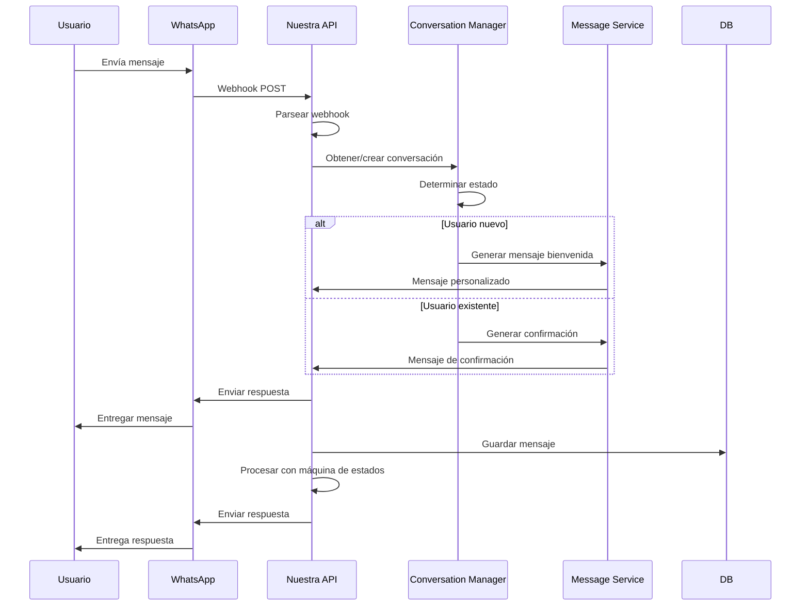
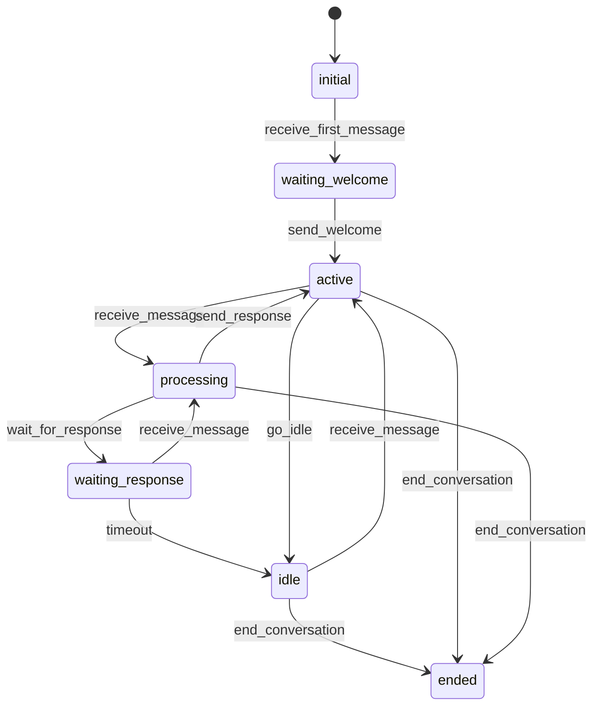

# Sistema de WhatsApp Business API

## 📱 Configuración Inicial

### 1. Crear Aplicación en Facebook Developers

1. Ir a [Facebook Developers](https://developers.facebook.com/)
2. Crear nueva aplicación
3. Agregar producto "WhatsApp Business API"
4. Configurar webhook y permisos

### 2. Obtener Credenciales

#### Access Token
- Ir a "WhatsApp > API Setup"
- Copiar el "Temporary access token" o generar uno permanente

#### Phone Number ID
- En "WhatsApp > API Setup"
- Copiar el "Phone number ID"

#### Webhook Verify Token
- Crear un token personalizado (ej: "mi_token_secreto_123")
- Usar este token en la configuración del webhook

### 3. Configurar Webhook

#### URL del Webhook
```
https://tu-dominio.com/api/v1/whatsapp/webhook
```

#### Campos a suscribir
- `messages`: Para recibir mensajes
- `message_deliveries`: Para recibir confirmaciones de entrega
- `message_reads`: Para recibir confirmaciones de lectura

## 🔄 Flujo de Mensajes

### 1. Mensaje Entrante



### 2. Estados de Conversación



## 🤖 Sistema de Conversaciones

### Gestión de Estados

El sistema utiliza una máquina de estados para gestionar conversaciones de WhatsApp:

#### Estados Disponibles

- **`initial`**: Estado inicial cuando se crea una conversación
- **`waiting_welcome`**: Esperando enviar mensaje de bienvenida
- **`active`**: Conversación activa, esperando mensajes del usuario
- **`processing`**: Procesando mensaje del usuario
- **`waiting_response`**: Esperando respuesta específica del usuario
- **`idle`**: Conversación inactiva por timeout
- **`ended`**: Conversación terminada

#### Transiciones Automáticas

```python
# Primer mensaje recibido
conversation.receive_first_message(message_data)
# initial → waiting_welcome

# Mensaje de bienvenida enviado
conversation.send_welcome()
# waiting_welcome → active

# Usuario envía mensaje
conversation.receive_message(message_data)
# active → processing

# Respuesta enviada
conversation.send_response()
# processing → active
```

### Procesamiento Inteligente

#### Usuarios Nuevos vs Existentes

El sistema detecta automáticamente si es un usuario nuevo:

```python
# Determinar si es usuario nuevo
is_new_user = conversation.message_count == 0

if is_new_user:
    # Enviar mensaje de bienvenida personalizado
    welcome_message = message_service.get_welcome_message(
        is_new_user=True,
        user_name=contact_info.get("name", ""),
        company_name=settings.COMPANY_NAME
    )
else:
    # Enviar confirmación de mensaje recibido
    confirmation_message = message_service.get_confirmation_message("received")
```

#### Contexto de Conversación

Cada conversación mantiene contexto:

```python
# Datos del usuario
conversation.user_data = {
    "name": "Juan Pérez",
    "wa_id": "5492617510062"
}

# Contexto personalizado
conversation.context = {
    "last_product_viewed": "cafe_americano",
    "preferences": ["sin_azucar", "leche_almendra"]
}
```

### Logs de Desarrollo

Cuando `DEBUG=True`, el sistema registra información detallada:

```json
{
  "level": "INFO",
  "message": "[DESARROLLO] Estado de conversación - ID: 5492617510062",
  "conversation_state": "active",
  "message_count": 3,
  "is_new_user": false
}
```

Los logs incluyen:
- Estado actual de la conversación
- Contador de mensajes
- Datos del usuario
- Contexto de la conversación
- Errores detallados con contexto completo

## 📝 Personalización de Mensajes

### Archivo de Configuración

Los mensajes se configuran en `app/data/messages.yaml`:

```yaml
messages:
  welcome:
    new_user: |
      ¡Hola! 👋 
      
      Bienvenido/a a nuestro servicio de atención al cliente. 
      
      Soy tu asistente virtual y estoy aquí para ayudarte con cualquier consulta que tengas sobre nuestros productos y servicios.
      
      ¿En qué puedo ayudarte hoy? 😊
    
    returning_user: |
      ¡Hola de nuevo! 👋
      
      Me alegra verte otra vez. 
      
      ¿Hay algo en lo que pueda ayudarte hoy? Estoy aquí para resolver cualquier duda que tengas.
  
  error:
    general: |
      Lo siento, ha ocurrido un error técnico. 😔
      
      Por favor, intenta de nuevo en unos minutos o contacta con nuestro equipo de soporte.
```

### Variables Dinámicas

Puedes usar variables en los mensajes:

```yaml
messages:
  welcome:
    new_user: |
      ¡Hola {user_name}! 👋
      
      Bienvenido/a a {company_name}
```

Y pasarlas al enviar:

```python
message = message_service.get_welcome_message(
    is_new_user=True,
    user_name="Juan",
    company_name="Cafe API"
)
```

## 🔧 API de WhatsApp

### Enviar Mensaje de Texto

```python
from app.services.whatsapp_service import whatsapp_service

result = await whatsapp_service.send_message(
    to="5511999999999",
    message="¡Hola! ¿Cómo estás?",
    message_type="text"
)
```

### Enviar Mensaje de Plantilla

```python
result = await whatsapp_service.send_template_message(
    to="5511999999999",
    template_name="hello_world",
    language_code="es"
)
```

### Procesar Mensaje Entrante

```python
message_data = {
    "type": "message",
    "message_id": "wamid.xxx",
    "from": "5511999999999",
    "timestamp": datetime.now(),
    "message_type": "text",
    "content": "Hola",
    "contact_info": {
        "name": "Juan Pérez",
        "wa_id": "5511999999999"
    }
}

result = await whatsapp_service.process_incoming_message(message_data)
```

## 📊 Monitoreo y Estadísticas

### Endpoint de Estadísticas

```bash
GET /api/v1/whatsapp/conversations
```

**Response:**
```json
{
  "stats": {
    "total_conversations": 10,
    "active_conversations": 3,
    "idle_conversations": 7
  },
  "active_conversations": [
    {
      "conversation_id": "5511999999999",
      "state": "active",
      "message_count": 5,
      "last_activity": "2025-01-09T23:00:00Z",
      "is_new_user": false
    }
  ]
}
```

### Logs de WhatsApp

Los logs se guardan en `logs/whatsapp.log`:

```json
{
  "timestamp": "2025-01-09T23:00:00Z",
  "level": "INFO",
  "logger": "whatsapp",
  "message": "Mensaje procesado: wamid.xxx para 5511999999999",
  "message_id": "wamid.xxx",
  "phone_number": "5511999999999",
  "conversation_id": "5511999999999",
  "status": "processed"
}
```

## 🚨 Manejo de Errores

### Errores Comunes

#### 1. Token Inválido
```json
{
  "error": {
    "code": "WHATSAPP_AUTH_ERROR",
    "message": "Token de acceso inválido",
    "status_code": 401
  }
}
```

#### 2. Número de Teléfono Inválido
```json
{
  "error": {
    "code": "WHATSAPP_SEND_ERROR",
    "message": "Número de teléfono inválido",
    "status_code": 400,
    "details": {
      "phone_number": "123"
    }
  }
}
```

#### 3. Límite de Velocidad
```json
{
  "error": {
    "code": "RATE_LIMIT_ERROR",
    "message": "Límite de velocidad excedido",
    "status_code": 429,
    "details": {
      "retry_after": 60
    }
  }
}
```

### Recuperación de Errores

```python
from app.core.error_handling import WhatsAppException

try:
    result = await whatsapp_service.send_message(to, message)
except WhatsAppException as e:
    # Manejar error específico de WhatsApp
    logger.error(f"Error de WhatsApp: {e.message}")
    # Implementar lógica de reintento si es necesario
```

## 🔒 Seguridad

### Validación de Webhook

El sistema valida automáticamente los webhooks de WhatsApp:

```python
def verify_webhook(self, mode: str, token: str, challenge: str) -> Optional[str]:
    if mode == "subscribe" and token == self.verify_token:
        return challenge
    return None
```

### Sanitización de Datos

Todos los datos entrantes se sanitizan:

```python
def _parse_message(self, message: Dict[str, Any], value: Dict[str, Any]) -> Optional[Dict[str, Any]]:
    # Validar y sanitizar datos del mensaje
    from_number = message.get("from", "").strip()
    content = message.get("text", {}).get("body", "").strip()
    # ... más validaciones
```

## 🧪 Testing

### Probar Webhook Localmente

1. **Usar ngrok para exponer el puerto:**
```bash
ngrok http 8000
```

2. **Configurar webhook en Facebook:**
```
https://tu-ngrok-url.ngrok.io/api/v1/whatsapp/webhook
```

3. **Enviar mensaje de prueba desde WhatsApp**

### Testing de Endpoints

```bash
# Verificar webhook
curl "http://localhost:8000/api/v1/whatsapp/webhook?hub.mode=subscribe&hub.challenge=test&hub.verify_token=tu_token"

# Enviar mensaje de prueba
curl -X POST "http://localhost:8000/api/v1/whatsapp/send-message" \
  -H "Content-Type: application/json" \
  -d '{"to": "5511999999999", "message": "Mensaje de prueba"}'

# Ver conversaciones
curl "http://localhost:8000/api/v1/whatsapp/conversations"
```

## 📈 Escalabilidad

### Optimizaciones

1. **Cache de Conversaciones**
```python
from functools import lru_cache

@lru_cache(maxsize=1000)
def get_conversation(conversation_id: str):
    return conversation_manager.get_or_create_conversation(conversation_id)
```

2. **Procesamiento Asíncrono**
```python
import asyncio
from celery import Celery

@celery.task
def process_whatsapp_message(message_data):
    # Procesar mensaje en background
    pass
```

3. **Rate Limiting**
```python
from slowapi import Limiter
from slowapi.util import get_remote_address

limiter = Limiter(key_func=get_remote_address)

@app.post("/api/v1/whatsapp/webhook")
@limiter.limit("100/minute")
async def receive_webhook(request: Request):
    # Endpoint con límite de velocidad
    pass
```

## 🔄 Mantenimiento

### Limpieza Automática

```python
# Limpiar conversaciones expiradas
conversation_manager.cleanup_expired_conversations()
```

### Backup de Datos

```bash
# Backup de base de datos
sqlite3 cafe_whatsapp.db ".backup backup_$(date +%Y%m%d).db"

# Backup de logs
tar -czf logs_backup_$(date +%Y%m%d).tar.gz logs/
```

### Monitoreo de Salud

```bash
# Verificar estado de la API
curl http://localhost:8000/health

# Verificar logs de errores
tail -f logs/errors.log

# Verificar estadísticas de WhatsApp
curl http://localhost:8000/api/v1/whatsapp/conversations
```

---

**Sistema de WhatsApp Business API** - Integración profesional con máquina de estados y manejo de errores robusto.
